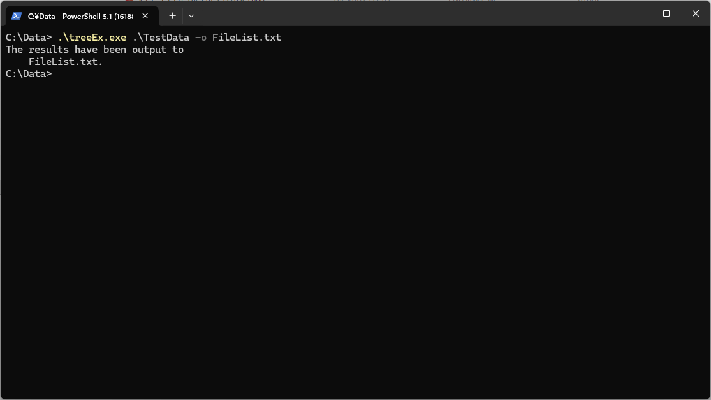

# treeEx について

Windows 環境向けの改良版 `tree` コマンドです。  
標準の `tree` コマンドでは対応できない **隠し属性ファイル、隠し属性ディレクトリの表示** や、**ユニコード絵文字を含むパスのファイル出力**に対応しています。

- [treeEx について](#treeex-について)
  - [特徴](#特徴)
  - [開発環境](#開発環境)
  - [使い方](#使い方)
    - [入力例](#入力例)
      - [カレントディレクトリ以下を コンソール に出力](#カレントディレクトリ以下を-コンソール-に出力)
      - [C:\\Data 以下 を コンソール に出力](#cdata-以下-を-コンソール-に出力)
      - [C:\\Data 以下 を ファイル FileList.txt に出力](#cdata-以下-を-ファイル-filelisttxt-に出力)
    - [📂 出力例](#-出力例)
      - [コンソール出力（例）](#コンソール出力例)
      - [ファイル出力（例）](#ファイル出力例)
      - [出力ファイルの内容（例）](#出力ファイルの内容例)
  - [⚠️ 注意事項](#️-注意事項)
  - [📄 ライセンス](#-ライセンス)
  - [免責事項](#免責事項)

## 特徴

- UTF-8 出力対応（ファイル出力時は BOM 付き、改行コード LF）
- Unicode 絵文字や日本語ファイル名の文字化け防止
- 隠し属性ファイル・隠し属性ディレクトリも表示
- ファイルとディレクトリを自然順（StrCmpLogicalW）でソート
- 出力先を指定可能（`-o` オプション）

## 開発環境

- Windows 11 Home
- Visual Studio 2026 Visual C++

## 使い方

```PowerShell
treeEx [開始ディレクトリ] [-o 出力ファイルパス]
```

開始ディレクトリ  

- 階層構造を取得したいディレクトリを指定します。ここで指定したディレクトリ以下の階層構造をツリー形式で出力します。
- 省略可能です。省略した場合は、カレントディレクトリに対して処理を行います。
- 開始ディレクトリを指定する場合、ディレクトリの末尾に `\` を付けないで下さい。
  
出力ファイルパス  

- 省略可能です。省略した場合には、コンソールに結果を出力します。
- ファイル出力する場合は、`-o` または `/o` の後に、出力ファイル名を指定して下さい。
- ファイル出力を指定した場合には、コンソールには結果を出力しません。

### 入力例

#### カレントディレクトリ以下を コンソール に出力

```PowerShell
treeEx
```

#### C:\Data 以下 を コンソール に出力

```PowerShell
treeEx C:\Data
```

#### C:\Data 以下 を ファイル FileList.txt に出力

```PowerShell
treeEx C:\Data -o FileList.txt
```

### 📂 出力例

#### コンソール出力（例）

  

#### ファイル出力（例）

  

#### 出力ファイルの内容（例）

```text
.\TestData
│  サンプル🚀123.txt
│  𠮷野家.txt
└─Data
    ├─Archive
    │    ArchiveAttribute.txt
    │    empty.txt
    │    HiddenAttribute.txt
    │    ReadOnlyAttribute.txt
    │    ReadOnlyHiddenAttribute.txt
    ├─Hidden
    │    ArchiveAttribute.txt
    │    empty.txt
    │    HiddenAttribute.txt
    │    ReadOnlyAttribute.txt
    │    ReadOnlyHiddenAttribute.txt
    ├─ReadOnly
    │    ArchiveAttribute.txt
    │    empty.txt
    │    HiddenAttribute.txt
    │    ReadOnlyAttribute.txt
    │    ReadOnlyHiddenAttribute.txt
    ├─ReadOnlyHidden
    │    ArchiveAttribute.txt
    │    empty.txt
    │    HiddenAttribute.txt
    │    ReadOnlyAttribute.txt
    │    ReadOnlyHiddenAttribute.txt
    ├─SpecialName
    │    no Extention File
    │    noExtentionFile
    │    with Space Name.txt
    │    with_UnderScore_Name.txt
    │    with-Hyphen-Name.txt
    │    withUnicodeString🍋🍓.txt
    ├─with Space
    │    ArchiveAttribute.txt
    │    empty.txt
    │    HiddenAttribute.txt
    │    ReadOnlyAttribute.txt
    │    ReadOnlyHiddenAttribute.txt
    └─withUnicodeString🍎🥕
          ArchiveAttribute.txt
          empty.txt
          HiddenAttribute.txt
          ReadOnlyAttribute.txt
          ReadOnlyHiddenAttribute.txt
```

## ⚠️ 注意事項

- 出力ファイルは UTF-8 (BOM付き) で保存されます。
- 開始ディレクトリを指定する場合、ディレクトリの末尾には、 `\` を付けないでください。
- アクセス権限のないディレクトリは [Access error] として表示されます。

## 📄 ライセンス

- MIT License

## 免責事項

- 本ソフトウェアは「現状のまま」提供されます。  
- 作者は、本ソフトウェアの使用または使用不能から生じるいかなる損害についても責任を負いません。  
- 本ソフトウェアの利用は、利用者自身の責任において行ってください。  
- 出力結果の正確性や完全性を保証するものではありません。  
- 本ソフトウェアは学習・研究・個人利用を目的としており、商用利用や業務利用に際しては必ず自己責任で検証してください。
